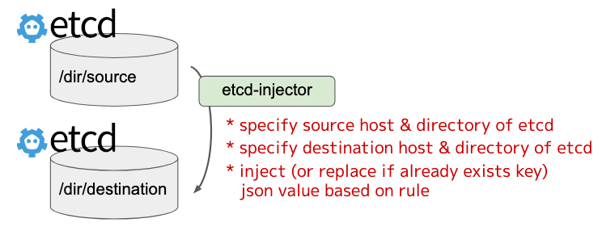

# etcd-injector

recursive copy & inject (or replace) json value of etcd



### Usage

```
USAGE:
   etcd-injector [options]

OPTIONS:
   --src-endpoints value             source endpoints of etcd [$ETCD_SRC_ENDPOINTS]
   --dst-endpoints value             destination endpoints of etcd [$ETCD_DST_ENDPOINTS]
   --src-directory value, -s value   source directory of etcd [$ETCD_SRC_DIRECTORY]
   --dst-directory value, -d value   destination directory of etcd [$ETCD_DST_DIRECTORY]
   --rules-filepath value, -f value  path of file written injection rules [$RULES_FILEPATH]
   --help, -h                        show help (default: false)
   --version, -v                     print the version (default: false)
```
